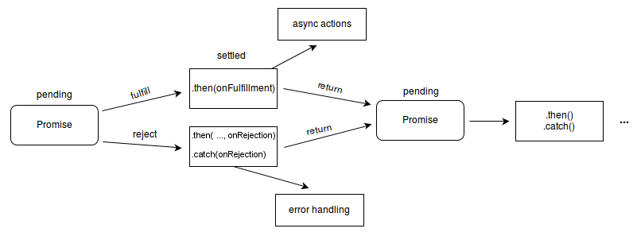

# Promise
## JS là đơn luồng
	Javascript là ngôn ngữ chạy một luồng duy nhất, nghĩa là một đoạn mã xử lý một nhiệm vụ sẽ chỉ chạy một lần duy nhất và nếu có lần thứ hai thì nó phải chờ lần thứ nhất kết thúc, điều này tuân thủ theo nguyên tắt hoạt động đồng bộ và hoạt động này đã gây ra phiền toái cho một số trường hợp. Hai người đàn ông cần cắt tóc để đi gặp cùng một người yêu và họ đã vào cắt tại một tiệm Salon duy nhất nằm trong làng, khốn nạn ở chỗ cả hai đến cùng thời điểm nên thợ cắt tóc chỉ có thể cắt một trong hai người mà thôi, người còn lại vui lòng chờ đến lượt. Vậy hành đồng cắt tóc của người thứ nhất đã làm ảnh hưởng đến người thứ hai, và người thứ hai sẽ mất một khoảng thời gian chờ để đến lượt của mình (ta gọi là đồng bộ - Synchronous).
	

## Code
console.log(1);
var promise1 = new Promise(function(resolve, reject) {
	console.log(2);setTimeout(function() {resolve('foo');}, 300);
});
promise1.then(
	function(solv) {console.log(4);console.log(solv);},
	function(rv) {console.log(4);console.log(rv);}
);
console.log(3);
// OR
// Nếu có cả callback error và catch  thì catch sẽ không chạy
promise1.then(function(solv) {console.log(4);console.log(solv);},)
.catch(function(rv) {console.log(4);console.log('Err: '+rv);});
### Thực hiện promise all (thành công khi tất cả promises rejected)
Promise.all([$('img')]).then(function() {
    // all loaded
}, function(img) {
    $(img).attr('src', 'default.png');
});

## Description
Một Promise có những trạng thái
	* pending: trạng thái ban đầu, không hoàn thành cũng không bị từ chối.
	* fulfilled: có nghĩa là các hoạt động hoàn thành thành công.
	* rejected: có nghĩa là hoạt động thất bại.
	(rejected & fulfilled gọi là settled: xử lý xong)
## Gọi 2 hàm callback
	Hai hàm callback trong then chỉ xảy ra một trong hai mà thôi, điều này tương ứng ở Promise sẽ khai báo một là Resolve và hai là Reject, nếu khai báo cả hai thì nó chỉ có tác dụng với khai báo đầu tiên.

# async/await
async function() {
  try {
    const user = await api.getUser('pikalong')
    const posts = await api.getPostsOfUser(user)
    const comments = await api.getCommentsOfPosts(posts)
    console.log(comments)
  } catch (err) {console.log(err)}
}
### Cần lưu ý là kết quả trả về của async function luôn là một Promise.

