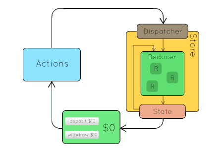

# Redux là gì ?
	Redux js là một thư viện JS giúp tạo ra thành một lớp quản lý trạng thái của ứng dụng.

	Redux được xây dựng dựa trên nền tảng tư tưởng của ngôn ngữ Elm và kiến trúc Flux do Facebook giới thiệu.

## Three Principles
	+ Nguồn dữ liệu tin cậy duy nhất (Single source of truth) : State của toàn bộ ứng được chứa trong một object tree nằm trong Store duy nhất

	+ Trạng thái chỉ được phép đọc (State is read-only) : Cách duy nhất để thay đổi State của ứng dụng là phát một Action (là 1 object mô tả những gì xảy ra)

	+ Thay đổi chỉ bằng hàm thuần túy (Changes are made with pure functions) : Để chỉ ra cách mà State được biến đổi bởi Action chúng ta dùng các pure function gọi là Reducer

## 4 thành phần redux

	+ Actions: Là nơi mang các thông tin dùng để gửi từ ứng dụng đến Store. Các thông tin này là 1 object mô tả những gì đã xảy ra.

	+ Reducers: Là nơi xác định State thay đổi như thế nào.

	+ Store: Là nơi quản lý State, cho phép truy cập State qua getState(), update State qua dispatch(action), đăng kí listener qua subscribe(listener).
	Lưu ý: action để dispatch phải là object

	+ View: Hiển thị dữ liệu được cung cấp bởi Store

	*** Cách giải thích 2
	+ Actions: các khối thông tin (payloads) gửi dữ liệu từ ứng dụng của bạn đến Store. Chúng là nguồn thông tin duy nhất cho Store. Bạn có thể gửi chúng đến Store bằng cách sử dụng store.dispatch().
	+ Reducers: Lắng nghe các hành động (Actions) và thực hiện các thay đổi trên các giá trị của Store. Hãy nhớ rằng các hành động chỉ mô tả những gì đã xảy ra, nó không thay đổi dữ liệu trên Store.
	+ Store: Quản lý nhiều reducers.
	+ Provider: là component chứa nhiều store.

## Dòng dữ liệu
### 1. You call store.dispatch(action).
	An action is a plain object describing what happened. For example:
		{ type: 'LIKE_ARTICLE', articleId: 42 }
### 2. The Redux store calls the reducer function you gave it.
	The store will pass two arguments to the reducer: the current state tree and the action

### 3. The root reducer may combine the output of multiple reducers into a single state tree.
	a) Sử dụng combineReducers helper

	
	b) Khi emit 1 action, todoApp returned by combineReducers sẽ gọi tất cả reducers:

	c) Sau đó nó sẽ kết hợp 2 tập kết quả vào 1 cây duy nhất

### 4. The Redux store saves the complete state tree returned by the root reducer.

## Usage with React

	Note:
		mapStateToProps : thực hiện việc map state vào prop của react component với các thuộc tính: state, ownProps
		mapDispatchToProps : thực hiện việc map dispatch vào prop của react component với các thuộc tính: state, ownProps
		Trong đó ownProps là props sẵn có của component, ví dụ: <Component propOne="Hello" />

# Middleware
## Khái niệm
	Middleware khá phổ biến với các Framework server-side, nó được đặt giữa thời điểm server nhận request và thời điểm server response.
	Ở Redux, Middleware giải quyết vấn đề khác với các Framework server-side nhưng định nghĩa có phần tương tự:
		Middleware cho phép chúng ta can thiệp vào giữa thời điểm dispatch một action và thời điểm action đến được reducer.
		
		

# Redux Thunk
## Khái niệm
	Redux thunk cho phép chúng ta viết action (để truyền vào dispatch) là function thay vì bắt buộc là object như định nghĩa action mà Redux đưa ra.
	Thunk có thẻ dùng để trì hoãn việc dispatch 1 action, or chỉ dispatch nếu thỏa mãn 1 điều kiện nhất định. The inner function nhận vào 2 tham số là store methods dispatch và getState.

# Redux Saga
## Khái niệm
	Khác với Redux-thunk, thì Redux-saga tạo ra phần side-effect độc lập với actions và mỗi action tương ứng sẽ có 1 saga tương ứng xử lý.
	Saga = Worker + Watcher
## Saga effects
	Call (Gọi tới api hoặc 1 Promise, có truyền tham số)
	Fork: rẽ nhánh sang 1 generator khác.
	Take: tạm dừng cho đến khi nhận được action
	Race: chạy nhiều effect đồng thời, sau đó hủy tất cả nếu một trong số đó kết thúc.
	Call:gọi function. Nếu nó return về một promise, tạm dừng saga cho đến khi promise được giải quyết.
	All:gọi các function. Thực hiện effects song song và đợi đến khi tất cả được giải quyết.
	Put: dispatch một action. (giống như dispatch của redux-thunk)
	Select: chạy một selector function để lấy data từ state.
	takeLatest: có nghĩa là nếu chúng ta thực hiện một loạt các actions, nó sẽ chỉ thực thi và trả lại kết quả của của actions cuối cùng.
	takeEvery: thực thi và trả lại kết quả của mọi actions được gọi.

## Sử dụng: applyMiddleware, sau đó run rootSaga, rootSaga sẽ watch tất cả các hành động

# React Router
	* Lưu ý: dùng exact để so khớp hoàn toàn url
	* Route : Route sẽ so sánh <Route>'s path prop với current location’s pathname. Nếu <Route> matches nó sẽ render content, ngược lại nó sẽ render null. Một <Route> không có path sẽ luôn luôn match.
	* Switch : Sẽ render duy nhất 1 content mà nó match đầu tiên với location.

